# Архитектура (C4)

Модель [C4](https://c4model.com): иерархия **Context → Container → Component**. Картинки — C4-PlantUML PNG в [`SPEC/c4/`](c4/README.md) (нотация как на c4model.com: имя, тип, описание, легенда). GitHub показывает PNG прямо в markdown; рядом лежат SVG и исходники `.puml`. Уровень **Code** (классы UML) не рисуем: это маленький TypeScript-монолит, карта файлов ниже заменяет его.

Зависимости только внутрь: `infrastructure → adapters → application → domain`. Domain не знает Fastify, grammY и `fetch`.

```
Context — SW Codex Bot
 └─ Container: SW Codex app          (единственный runtime)
 │    ├─ Infrastructure
 │    ├─ Telegram adapters (inbound)
 │    ├─ i18n adapters
 │    ├─ Application
 │    ├─ Domain
 │    └─ Outbound adapters (SWAPI, Visual Guide)
 └─ Container: Webhook CLI           (операционный, не держит апдейты)
```

Своей БД нет. Кэш и выбранный язык — in-memory внутри процесса приложения, не отдельные контейнеры.

## Level 1 — System Context

Система в центре. Вокруг — люди и **внешние** системы. Хостинг (Vercel) и CI — не контекст, см. [Deployment](#supporting-deployment).

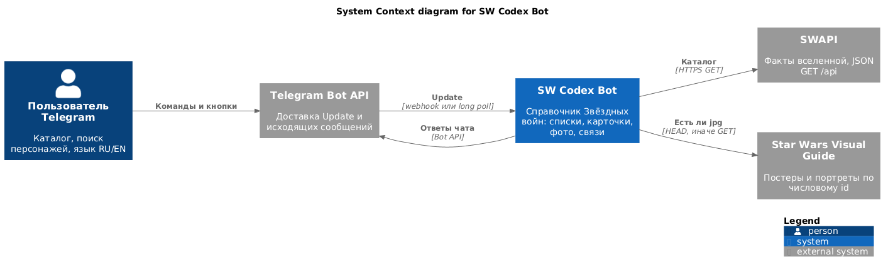

Исходник: [`c4/01-context.puml`](c4/01-context.puml)

| Элемент | Тип | Роль |
|---|---|---|
| Пользователь Telegram | Person | Единственный актор продукта |
| SW Codex Bot | Software System (in scope) | Этот репозиторий |
| Telegram Bot API | External system | Транспорт чата |
| SWAPI | External system | Каталог; запись запрещена |
| Visual Guide | External system | Картинки; 404 → карточка без фото |

## Level 2 — Containers

Контейнер C4 — отдельно запускаемый процесс, а не слой кода. В системе два контейнера; кэш и locale store живут **внутри** app.

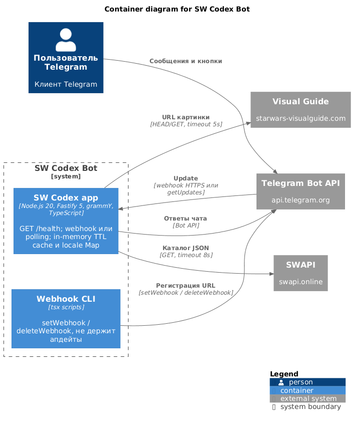

Исходник: [`c4/02-containers.puml`](c4/02-containers.puml)

| Контейнер | Технология | Что делает | Что это не есть |
|---|---|---|---|
| **SW Codex app** | Fastify 5 + grammY + TS | Единственный runtime продукта | Не микросервисы |
| **Webhook CLI** | `src/scripts/*.ts` | Регистрирует URL webhook | Не обрабатывает апдейты |
| Memory TTL cache | `Map` в процессе | Списки 5 мин, карточки/картинки 15 мин | Не Redis, не контейнер |
| User locale store | `Map<userId, Locale>` | ru/en до холодного старта | Не БД |

Режим app выбирает `loadConfig`: на Vercel и в `production` — webhook; локально — polling (`ENABLE_POLLING` перекрывает). Одновременно polling и `webhookCallback` grammY не позволяет.

## Level 3 — Components

Дальше — decomпозиция **SW Codex app**. Каждый компонент — модуль за явным интерфейсом (класс use case, порт, adapter), не отдельный класс поля.

### 3.0 Обзор контейнера

Слои как границы. Стрелки — compile-time зависимости (не HTTP).

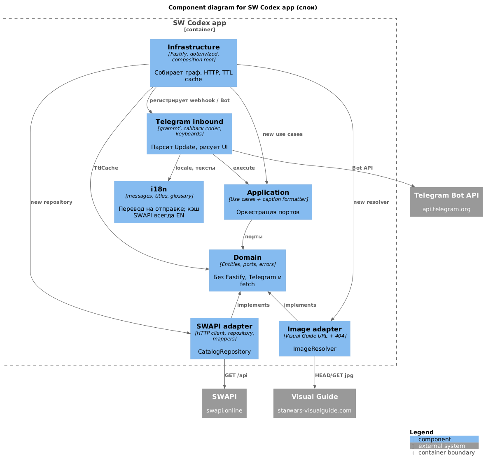

Исходник: [`c4/03-components-overview.puml`](c4/03-components-overview.puml)

Правило слоёв:

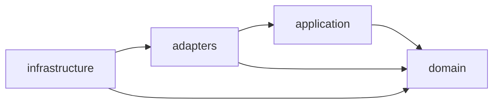

### 3.1 Infrastructure

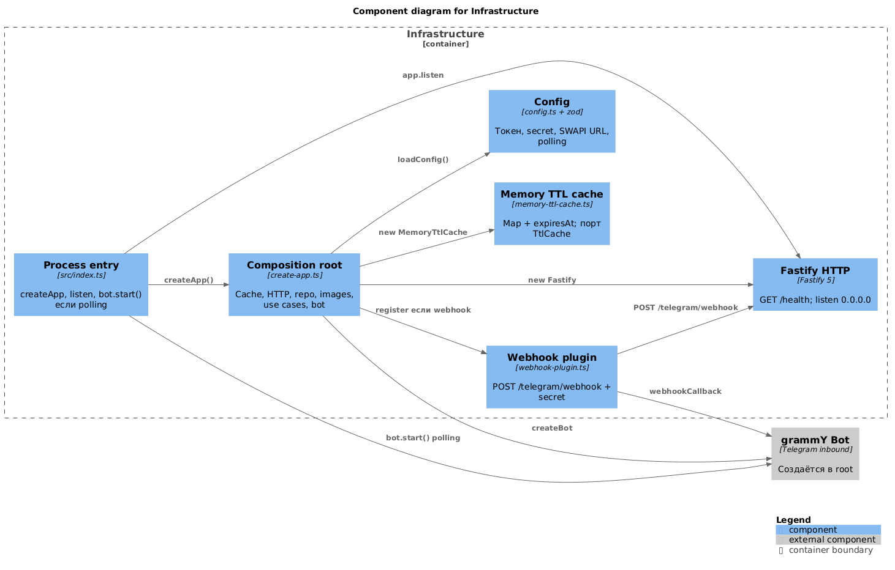

Исходник: [`c4/03-infrastructure.puml`](c4/03-infrastructure.puml)

`createApp` — единственная точка, где сходятся адаптеры и use cases (`AppBundle`: `app`, `bot`, `config`).

### 3.2 Telegram inbound

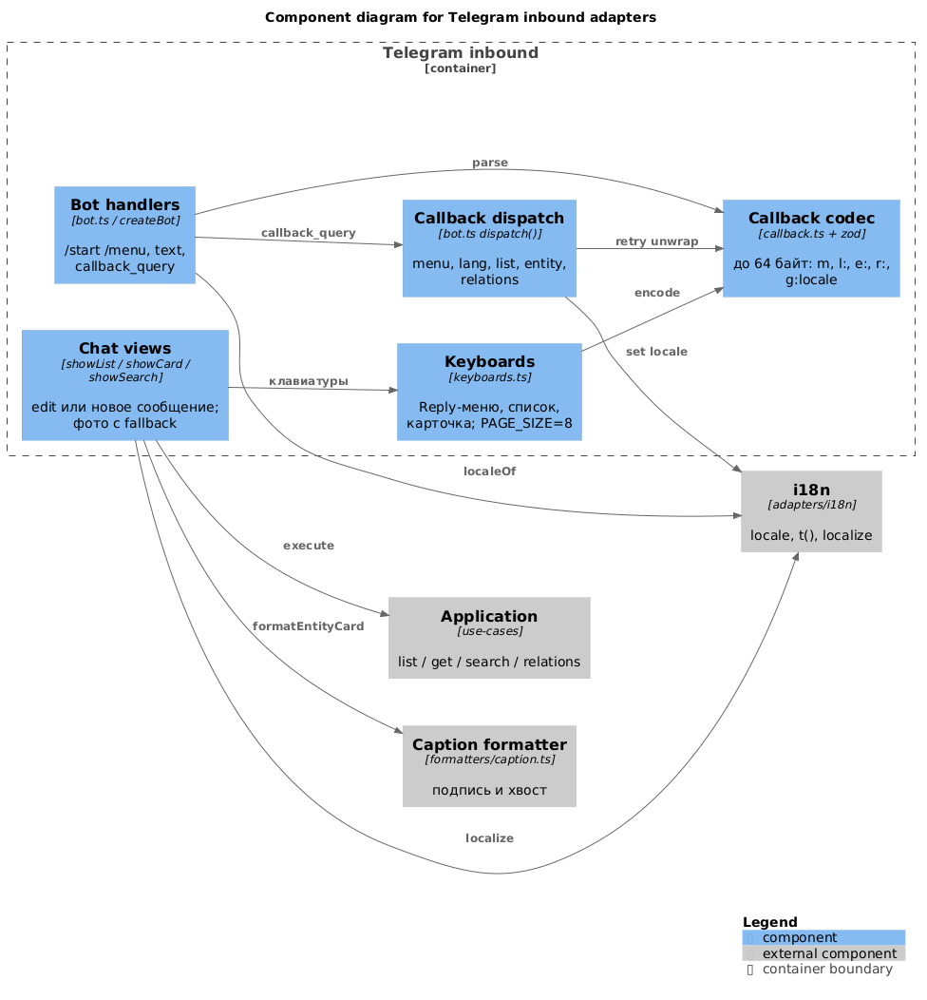

Исходник: [`c4/03-telegram.puml`](c4/03-telegram.puml)

Входные пути:

| Telegram update | Компонент | Use case |
|---|---|---|
| `/start`, `/menu`, кнопки меню/языка | handlers | нет (только i18n + keyboards) |
| Reply-кнопка раздела | handlers → showList | `ListCatalog` |
| Force Reply поиска | showSearch | `SearchCharacters` (после expand query) |
| `l:` / `e:` / `r:` / `x:` | dispatch → views | list / get / relations |
| `g:ru` / `g:en` | dispatch | UserLocaleStore |

### 3.3 i18n

Кэш SWAPI всегда английский. Перевод — слой отображения перед Telegram.

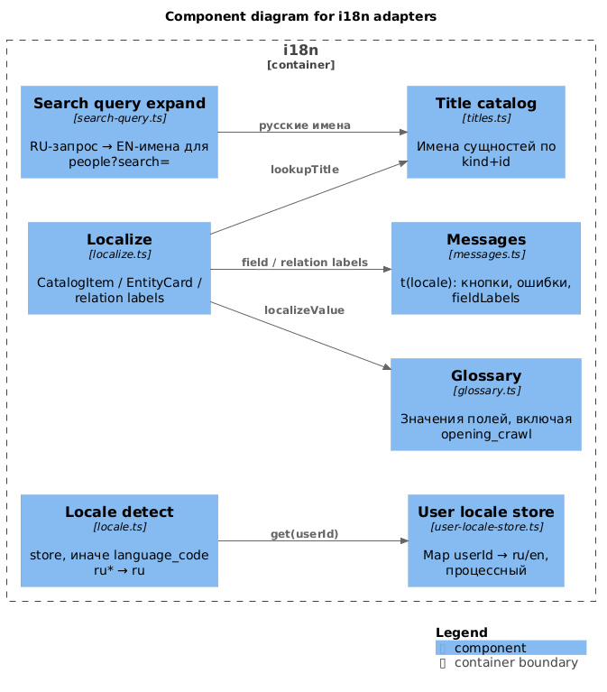

Исходник: [`c4/03-i18n.puml`](c4/03-i18n.puml)

### 3.4 Application

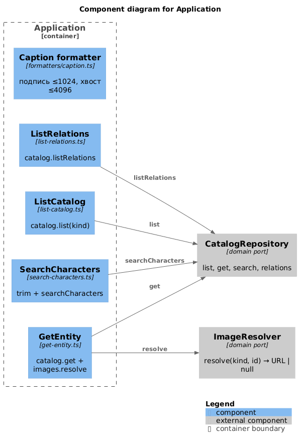

Исходник: [`c4/03-application.puml`](c4/03-application.puml)

Use cases не знают Telegram и HTTP. `GetEntity` — единственный, кто трогает оба порта.

### 3.5 Domain

Ядро. Нет исходящих зависимостей на адаптеры.

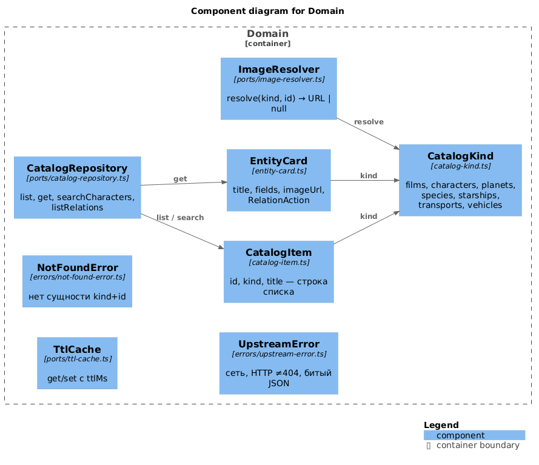

Исходник: [`c4/03-domain.puml`](c4/03-domain.puml)

### 3.6 Outbound adapters

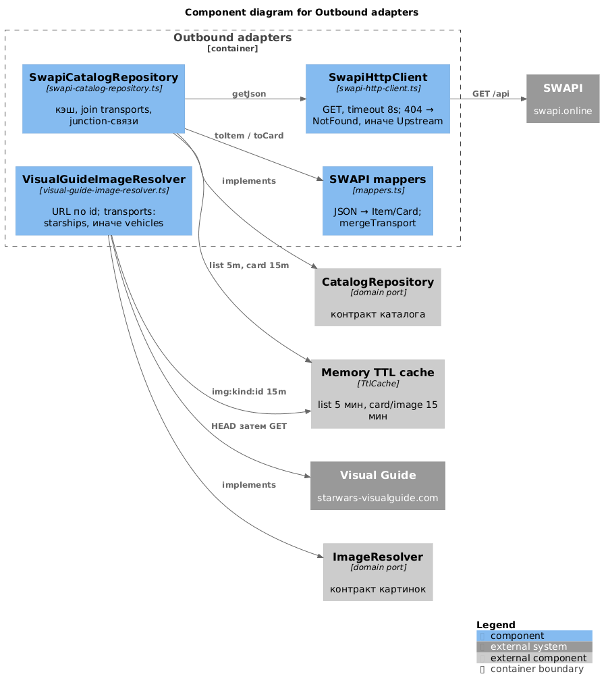

Исходник: [`c4/03-outbound.puml`](c4/03-outbound.puml)

Поведение репозитория, которое стоит видеть на этой глубине:

| Операция | HTTP | Кэш |
|---|---|---|
| `list(kind)` | `GET /api/{kind}`; starships/vehicles обогащаются именами transports | `list:{kind}` 5 мин |
| `get(starships\|vehicles)` | parallel `{kind}/{id}` + `transports/{id}` | `card:{kind}:{id}` 15 мин |
| `get(transports)` | transport + fallback starship/vehicle того же id | то же |
| `searchCharacters` | `GET /api/people?search=` | `search:{q}` 5 мин |
| `listRelations` | `/api/{from}/{id}/{rel}`; transports→characters: starships затем vehicles | `rel:…` 5 мин |
| `resolve` картинки | Visual Guide HEAD→GET | `img:{kind}:{id}` 15 мин |

### 3.7 Webhook CLI (второй контейнер)

Маленький контейнер, один «компонент» на скрипт.

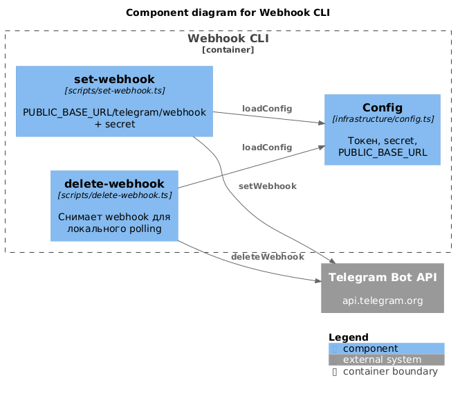

Исходник: [`c4/03-webhook-cli.puml`](c4/03-webhook-cli.puml)

## Component → файлы

| C4-компонент | Файлы |
|---|---|
| Process entry | `src/index.ts` |
| Composition root | `src/infrastructure/http/create-app.ts` |
| Config | `src/infrastructure/config.ts` |
| Fastify HTTP | `src/infrastructure/http/create-app.ts` (`GET /health`) |
| Webhook plugin | `src/adapters/telegram/webhook-plugin.ts` |
| Memory TTL cache | `src/infrastructure/cache/memory-ttl-cache.ts` |
| Bot handlers / dispatch / views | `src/adapters/telegram/bot.ts` |
| Callback codec | `src/adapters/telegram/callback.ts` |
| Keyboards | `src/adapters/telegram/keyboards.ts` |
| User locale store | `src/adapters/i18n/user-locale-store.ts` |
| Locale detect | `src/adapters/i18n/locale.ts` |
| Messages | `src/adapters/i18n/messages.ts` |
| Titles | `src/adapters/i18n/titles.ts` |
| Glossary | `src/adapters/i18n/glossary.ts` |
| Localize | `src/adapters/i18n/localize.ts` |
| Search query expand | `src/adapters/i18n/search-query.ts` |
| ListCatalog | `src/application/use-cases/list-catalog.ts` |
| GetEntity | `src/application/use-cases/get-entity.ts` |
| SearchCharacters | `src/application/use-cases/search-characters.ts` |
| ListRelations | `src/application/use-cases/list-relations.ts` |
| Caption formatter | `src/application/formatters/caption.ts` |
| CatalogKind / Item / EntityCard | `src/domain/entities/*` |
| Ports | `src/domain/ports/*` |
| Errors | `src/domain/errors/*` |
| SwapiHttpClient | `src/adapters/swapi/swapi-http-client.ts` |
| SWAPI mappers | `src/adapters/swapi/mappers.ts` |
| SwapiCatalogRepository | `src/adapters/swapi/swapi-catalog-repository.ts` |
| VisualGuideImageResolver | `src/adapters/images/visual-guide-image-resolver.ts` |
| set/delete webhook | `src/scripts/set-webhook.ts`, `src/scripts/delete-webhook.ts` |
| SWAPI smoke | `src/scripts/smoke-swapi.ts` |

## Supporting: Deployment

Не уровень C4 1–3. Показывает, *где* крутятся контейнеры.

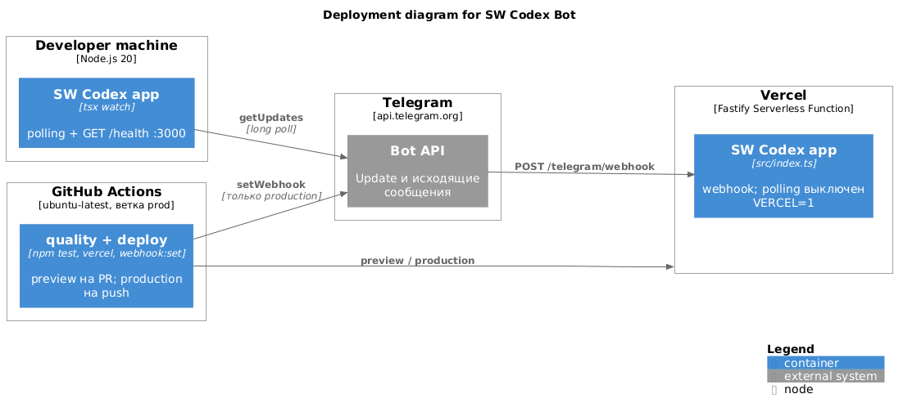

Исходник: [`c4/04-deployment.puml`](c4/04-deployment.puml)

| Среда | App | Telegram | Webhook CLI |
|---|---|---|---|
| Local `npm run dev` | polling | `bot.start()` | `webhook:delete` если URL ещё висит |
| Vercel Preview | webhook, но URL не регистрируют | не меняют prod webhook | не вызывают |
| Vercel Production | webhook | `POST /telegram/webhook` | `npm run webhook:set` из Actions |
