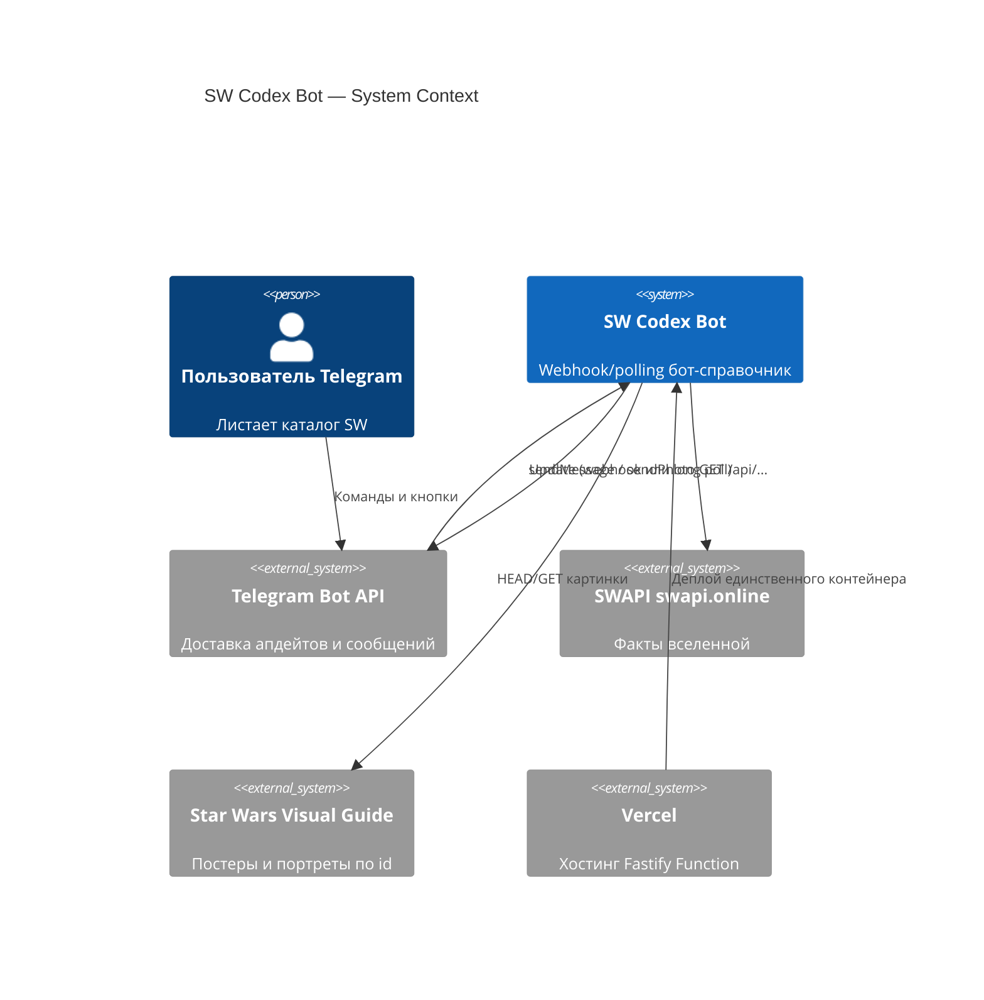
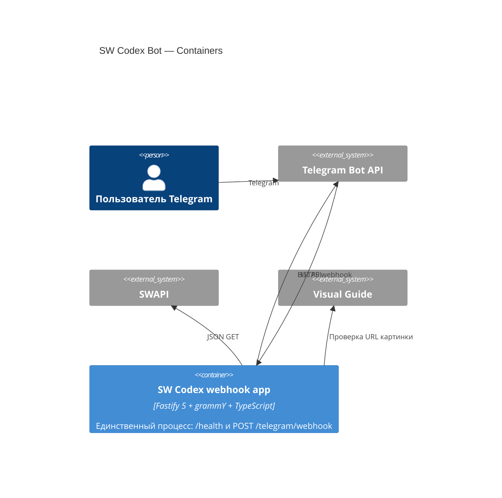
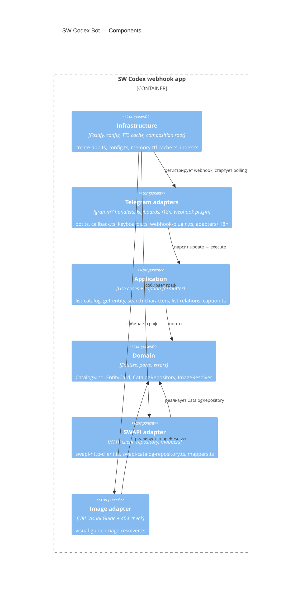

# Архитектура (C4)

Зависимости только внутрь: `infrastructure → adapters → application → domain`. Domain не знает Fastify, Telegram и `fetch`.

## Context

## Container

Один контейнер приложения. Своей БД нет. Поиск — ForceReply, не Redis.

## Components

## Компонент → файлы

| Группа | Файлы |
|---|---|
| Infrastructure | `src/infrastructure/http/create-app.ts`, `src/infrastructure/config.ts`, `src/infrastructure/cache/memory-ttl-cache.ts`, `src/index.ts` |
| Telegram adapters | `src/adapters/telegram/*`, `src/adapters/i18n/*` |
| Application | `src/application/use-cases/*`, `src/application/formatters/caption.ts` |
| Domain | `src/domain/entities/*`, `src/domain/ports/*`, `src/domain/errors/*` |
| SWAPI adapter | `src/adapters/swapi/*` |
| Image adapter | `src/adapters/images/visual-guide-image-resolver.ts` |
